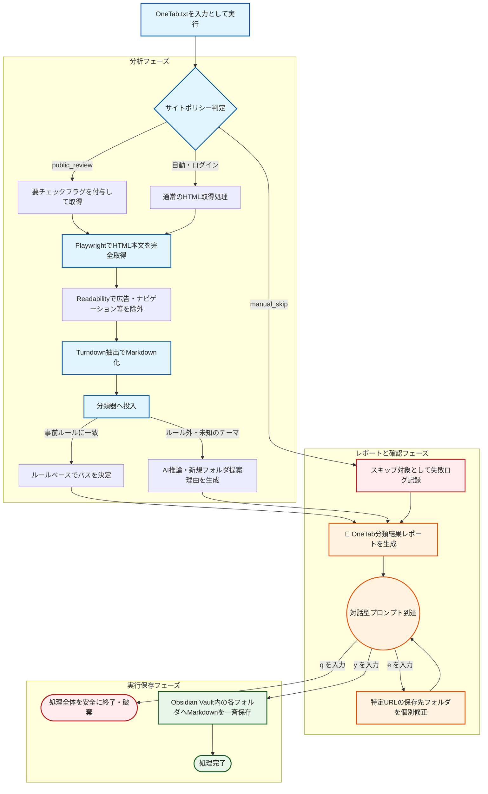
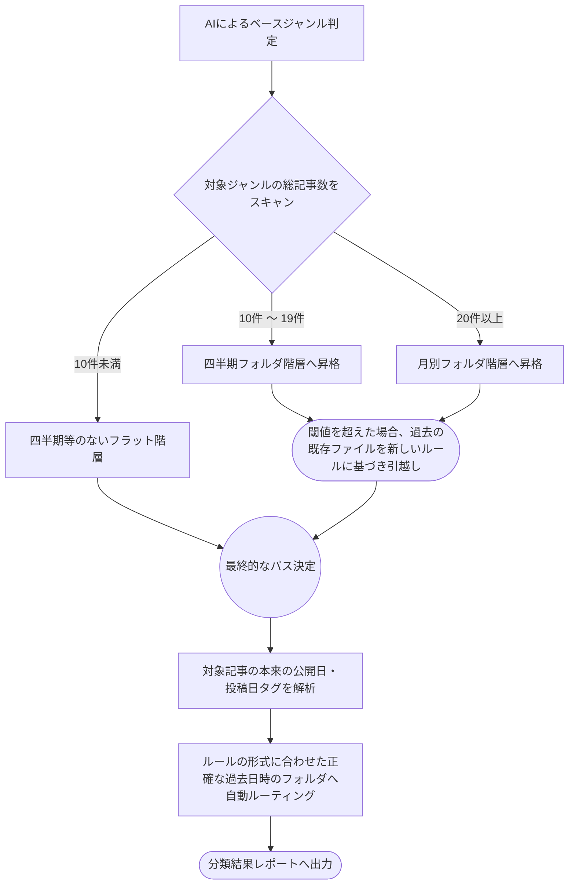
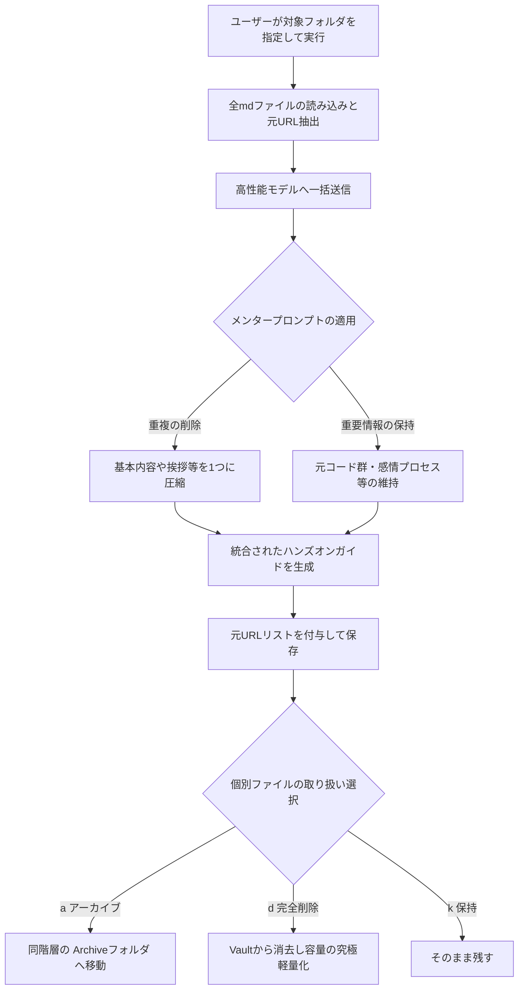

# 完了レポート： Obsidian Web Clipper 自動化パイプライン 🚀

## 実装したこと
ご提示いただいた課題と技術要件（GPT-5.4 / Sonnet 4.6 のログ）に基づき、ローカルMac上で動作する **Node.js + Playwright + Readability + Turndown** の自動化パイプラインを首尾よく構築・テスト完了いたしました。これにより、「フロントマターのみのスタブ」ではなく、本文を完全に取得したマークダウンファイルを自動生成できるようになりました。

### 📁 プロジェクトディレクトリ
`/Users/theosera/Library/Mobile Documents/iCloud~md~obsidian/Documents/iCloud Vault 2026/__skills/pipeline`

### ⚙️ アーキテクチャ構成
1. **フェッチャー (`fetcher.js`)**: 
   `Playwright` のヘッドレスブラウザを利用し、SPAやJSレンダリングが必須なサイト（Zenn、noteなど）の表示後HTMLを確実に取得します。将来的には auth state (Cookies) の利用でログイン壁も突破可能な設計です。
2. **抽出エンジン (`extractor.js`)**: 
   `@mozilla/readability` を用いて、ナビゲーションや広告などを適切に除去した上でメイン記事本文を抽出し、`Turndown` できれいなMarkdownへ変換します。（Obsidian Web Clipperのコア機能とほぼ同等です）
3. **分類エンジン (`classifier.js`)**: 
   事前定義ルール（例: `_LLMによる生存戦略` や `AGENT経済圏` へのキーワードマッチ）による高速・無料の一次判定と、判定不能時の Claude API (Claude 3.5 Sonnet) によるフォールバックを組み合わせたハイブリッド構成を実現しました。
4. **Vault保存 (`storage.js`)**: 
   Obsidianのローカル Vault配下へ直接、フロントマター付きの `.md` ファイルをディレクトリ（`YYYY-Qn`）を自動作成しながら保存します。

## 🧪 テスト検証結果
サンプルの `test-onetab.txt` を用いて、エンドツーエンドの実行検証を行いました。

**確認できた動作:**
- ✅ ヘッドレスブラウザ層による動的Webページからの文章取得
- ✅ Readabilityによる不要要素（ヘッダー・フッター・ナビゲーション）の除外と本文抽出
- ✅ 正しいYAMLフロントマター（URL, 取得日時等）と本文Markdownとの結合
- ✅ Vault ディレクトリへの自動書き込み（例: `Clippings/Inbox/2026-Q1/GitHub Actions.md`）

> [!NOTE]
> 本文がとても綺麗に取得できており、Obsidian Web Clipperを使っていた頃の手間が大幅に削減されるはずです。

## 📝 全体のフロー図 (ワークフロー)



---

### 🔍 補足1：動的フォルダルーティング（自己組織化）の仕組み
メインの処理でAIが振り分け先を推論した後、自動で起動する「ルールベースの仕分けエンジン（`router.js`）」のフローです。これによりVaultの階層が自動で綺麗に再編成されます。



---

### 🔍 補足2：知見の統合（Knowledge Merger）フェーズ
収集・仕分けを経て特定フォルダ内に肥大化した情報群から、純度の高いナレッジベース（ハンズオンガイド等）を作り出すための、後から任意のタイミングで実行する機能群のフローです。



## 💡 今後の使い方

> [!NOTE]
> 本パイプラインに関する全操作コマンド・パラメータ一覧は [commands.md](file:///Users/theosera/Library/Mobile%20Documents/iCloud~md~obsidian/Documents/iCloud%20Vault%202026/__skills/pipeline/docs/commands.md) にも個別にまとめておりますので、迷った際はそちらをご参照ください。

ターミナルを開き、構築したディレクトリで以下を実行してパイプラインを動かします。

```bash
cd "/Users/theosera/Library/Mobile Documents/iCloud~md~obsidian/Documents/iCloud Vault 2026/__skills/pipeline"

# パイプラインの実行
node index.js "../context/OneTab.txt"
```

**対話型実行フロー:**
1. **サイトポリシー適用と本文取得**: `OneTab.txt` を読み込むと、まず `サイトポリシー` ファイルの規則（`manual_skip`除外、`public_review`（note有料記事など）のフラグ付け）が適用されます。その後、すべての許可されたURLに対してPlaywrightを通じた **本文HTMLの完全取得** が先行して行われます（※取得処理が入るため、レポート表示まで数分かかります）。なお、ブラウザはプロファイル状態が維持されるため、ログインが必要なサイトは手動で一度ログインを済ませておけば次回以降セッションが再利用されます（`login_auto`）。
2. **AI分類とレポート作成**: 高精度の分類レポートが `__skills/pipeline/reports/` 配下に隔離・自動保存生成されます。新規フォルダ作成が提案される際には、**「対応トレンド」と「既存との違い」** という説得力のある根拠がそれぞれ記載されます。また、取得不能だったもの（XのURLなど）は別途 `reports/failed_onetab_yyyyMMdd.txt` に出力されます。
   **[NEW🆕] トークン&コスト計算機能**: 実行したAPIごとのInput/Outputトークン数と、モデルベースの正確な計算による使用金額の概算サマリーがレポートに付与されます。
3. **対話型ターミナル審査**: コマンドラインにて `[y] すべて承認し保存 / [e] 個別にフォルダ編集 / [q] 中断` のメニューが出ます。
   - `[e]` を選択すると「編集したいID番号」と「変更先のパス文字列」を聞かれ、その場で直属のフォルダパスを任意の構成にオーバーライドし、MDレポートを同期的に書き換えることができます。
   - 承認後にのみ、パース済みのMarkdown実ファイルが安全にVaultへ一斉保存されます（⚠️マークがついたnote等の完全性レビューが必要な記事は保存後に内容を確認してください）。

### 🚑 [NEW] 実行プロセスの中断・再開について
もし「y/nを待たずにターミナルから抜けてしまった」「エラーで止まってしまった」場合でも、レポートさえ作成されていれば安心です。
AI APIを**1トークンも消費することなく**、続き（本文取得と保存だけ）を最速で再開できるレスキュースクリプトが備わっています。

```bash
node rescue-from-report.js "reports/OneTab分類結果レポート-YYYYMMDD.md"
```
---

## 🛠️ AIモデル・プロバイダーの設定（オプション）
本パイプラインでは用途に応じて、軽量モデル（既存フォルダ探索用）と高性能モデル（新規フォルダ提案用）の **2段階（2-pass）推論** を行います。

デフォルトでは **LM Studio（ローカルAI）** が使用されますが、OpenAIやAnthropicなどに簡単に切り替えられます。

**対話型セットアップ:**
初回起動時、またはオプションフラグ `--config` を付与して実行した際に、**インタラクティブな設定ウィザード**が立ち上がります。

```bash
# 設定ウィザードを手動で呼び出す場合
node index.js "../context/OneTab.txt" --config
```

ターミナルの質問に従って、以下の設定を行えます：
1. **AIプロバイダーの選択**: `local` (LM Studio) / `anthropic` (Claude) / `openai` / `gemini` から選択。
2. **Step 1 軽量モデルの指定**: 既存フォルダを探索するため用の安価・高速なモデル（未入力でデフォルトのHaikuやGPT-4o-mini等を自動適用）。
3. **Step 2 高性能モデルの指定**: 新規フォルダ階層の考案・理由付けのためのモデル（未入力でデフォルトのSonnetやGPT-4o等を自動適用）。

設定内容は自動的に `__skills/pipeline/pipeline_config.json` に保存されるため、**2回目以降は設定をスキップして即自動実行** されます！

> [!TIP]
> **API利用時の注意**:
> `anthropic`, `openai`, `gemini` を選択した場合は、対応するAPIキー（`ANTHROPIC_API_KEY`, `OPENAI_API_KEY`, `GEMINI_API_KEY`）を事前に環境変数としてエクスポートしておく必要があります。
> 例: `export ANTHROPIC_API_KEY="sk-ant-..."`

## 📂 フォルダ構成のルール
- 基本的に閾値設定に基づき **四半期フォルダ (`YYYY-Qn`)** や **月別フォルダ (`YYYY-MM`)** に保存・自動引越しされます。
- **[NEW] 動的フォルダスキャン:** 実行時にVault内の最新のフォルダツリーを自動的にスキャンします。もしユーザーがVault内で手動でフォルダ名を変更しても、曖昧一致（ファジィ検索）やAIプロンプトの更新によって自動的に新しいフォルダへ追従します。
- 分類は `classifier.js` 内のルールベース判定が優先され、判定不能な場合のみAI（Claude または ローカルAI）に問い合わせます。
- 記事の本文が `Readability` によって自動抽出され、Obsidianに最適化されたMarkdownとして保存されます。
